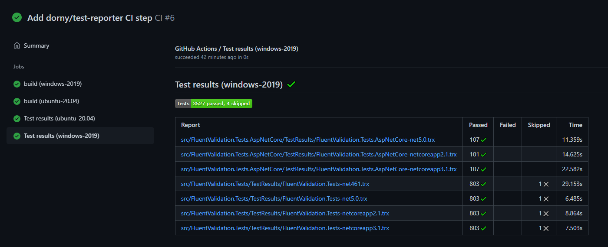
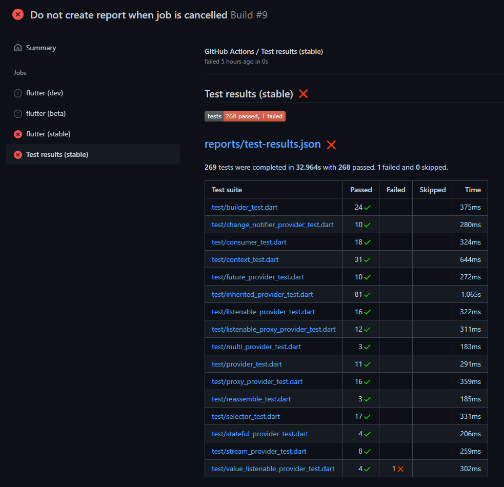
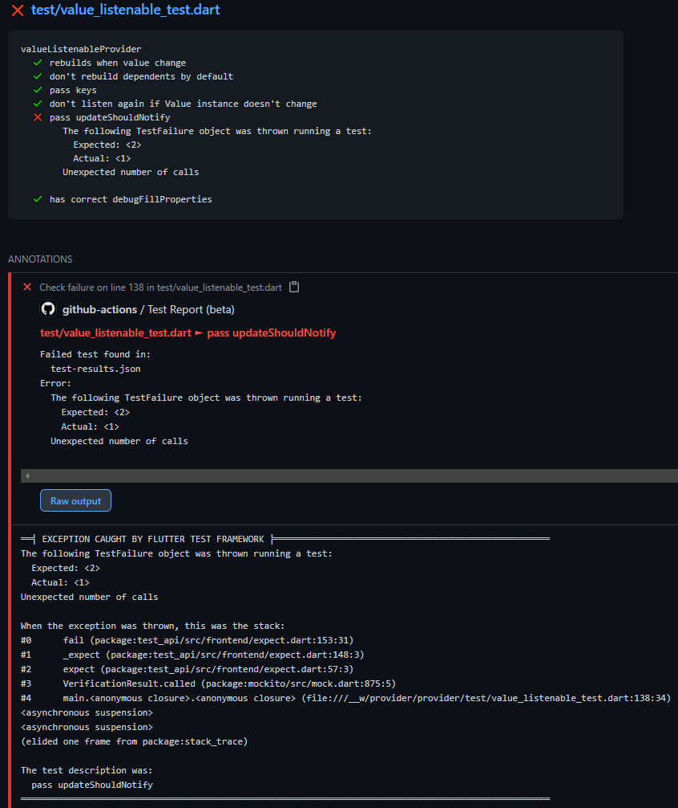

# Test Reporter

This [Github Action](https://github.com/features/actions) displays test results from popular testing frameworks directly in GitHub.
- [x] Parses test results in XML or JSON format and creates nice report (Github Check Run)
- [x] Annotates code where it failed based on message and stack trace captured during test execution
- [x] Sets output variable conclusion to `success` if all tests passed or `failure` if any test failed

**How it looks:**
|||||
|:--:|:--:|:--:|:--:|

**Supported languages / frameworks:**
- .NET / [xUnit](https://xunit.net/) / [NUnit](https://nunit.org/) / [MSTest](https://github.com/Microsoft/testfx-docs)
- Dart / [test](https://pub.dev/packages/test)
- Flutter / [test](https://pub.dev/packages/test)
- JavaScript / [JEST](https://jestjs.io/)

For more information see [Supported formats](#supported-formats) section.

**Support is planned for:**
- Java / [JUnit 5](https://junit.org/junit5/)

Do you miss support for your favorite language or framework?
Please create [Issue](https://github.com/dorny/test-reporter/issues/new) or contribute with PR.

## Example

```yaml
jobs:
  build-test:
    name: Build & Test
    runs-on: ubuntu-latest
    steps:
      - uses: actions/checkout@v2     # checkout the repo
      - run: npm ci                   # install packages
      - run: npm test                 # run tests (configured to use jest-junit reporter)

      - name: Test Report
        uses: dorny/test-reporter@v1
        if: success() || failure()    # run this step even if previous step failed
        with:
          name: JEST Tests            # Name of the check run which will be created
          path: reports/jest-*.xml    # Path to test report
          reporter: jest-junit        # Format of test report
```

## Usage

```yaml
- uses: dorny/test-reporter@v1
  with:

    # Name of the Check Run which will be created
    name: ''

    # Coma separated list of paths to test reports
    # Supports wildcards via [fast-glob](https://github.com/mrmlnc/fast-glob)
    # All matched result files must be of same format
    path: ''

    # Format of test report. Supported options:
    #   dart-json
    #   dotnet-trx
    #   flutter-json
    #   jest-junit
    reporter: ''

    # Limits which test suites are listed:
    #   all
    #   failed
    list-suites: 'all'

    # Limits which test cases are listed:
    #   all
    #   failed
    #   none
    list-tests: 'all'

    # Limits number of created annotations with error message and stack trace captured during test execution.
    # Must be less or equal to 50.
    max-annotations: '10'

    # Set action as failed if test report contain any failed test
    fail-on-error: 'true'

    # Relative path under $GITHUB_WORKSPACE where the repository was checked out.
    working-directory: ''

    # Personal access token used to interact with Github API
    # Default: ${{ github.token }}
    token: ''
```

## Supported formats

<details>
  <summary>dart-json</summary>

Test run must be configured to use [JSON](https://github.com/dart-lang/test/blob/master/pkgs/test/doc/configuration.md#reporter) reporter.
You can configure it in `dart_test.yaml`:

```yml
file_reporters:
  json: reports/test-results.json
```

Or with CLI arguments:

[`dart test --file-reporter="json:test-results.json"`](https://pub.dev/packages/test)

For more information see:
- [test package](https://pub.dev/packages/test)
- [test configuration](https://github.com/dart-lang/test/blob/master/pkgs/test/doc/configuration.md)
</details>

<details>
  <summary>dotnet-trx</summary>

Test execution must be configured to produce *Visual Studio Test Results* files (TRX).
To get test results in TRX format you can execute your tests with CLI arguments:

`dotnet test --logger "trx;LogFileName=test-results.trx"`

Or you can configure TRX test output in `*.csproj` or `Directory.Build.props`:
```xml
<PropertyGroup>
  <VSTestLogger>trx%3bLogFileName=$(MSBuildProjectName).trx</VSTestLogger>
  <VSTestResultsDirectory>$(MSBuildThisFileDirectory)/TestResults/$(TargetFramework)</VSTestResultsDirectory>
</PropertyGroup>
```

Supported testing frameworks:
- [xUnit](https://xunit.net/)
- [NUnit](https://nunit.org/)
- [MSTest](https://github.com/Microsoft/testfx-docs)

For more information see [dotnet test](https://docs.microsoft.com/en-us/dotnet/core/tools/dotnet-test#examples)
</details>

<details>
  <summary>flutter-json</summary>

Test run must be configured to use [JSON](https://github.com/dart-lang/test/blob/master/pkgs/test/doc/configuration.md#reporter) reporter.
You can configure it in `dart_test.yaml`:
```yml
file_reporters:
  json: reports/test-results.json
```

Or with (undocumented) CLI argument:

`flutter test --machine > test-results.json`


According to documentation `dart_test.yaml` should be at the root of the package, next to the package's pubspec.
On current `stable` and `beta` channels it doesn't work and you have to put `dart_test.yaml` inside your `test` folder.
On `dev` channel it's already fixed.

For more information see:
- [test package](https://pub.dev/packages/test)
- [test configuration](https://github.com/dart-lang/test/blob/master/pkgs/test/doc/configuration.md)
- [flutter-cli](https://flutter.dev/docs/reference/flutter-cli)
- [unit testing introduction](https://flutter.dev/docs/cookbook/testing/unit/introduction)

</details>

<details>
  <summary>jest-junit</summary>

[JEST](https://jestjs.io/) testing framework support requires usage of [jest-junit](https://github.com/jest-community/jest-junit) reporter.
It will create test results in junit XML format which can be then processed by this action.
You can use following example configuration in `package.json`:
```json
"scripts": {
  "test": "jest --ci --reporters=default --reporters=jest-junit"
},
"devDependencies": {
  "jest": "^26.5.3",
  "jest-junit": "^12.0.0"
},
"jest-junit": {
  "outputDirectory": "reports",
  "outputName": "jest-junit.xml",
  "ancestorSeparator": " › ",
  "uniqueOutputName": "false",
  "suiteNameTemplate": "{filepath}",
  "classNameTemplate": "{classname}",
  "titleTemplate": "{title}"
}
```

Configuration of `uniqueOutputName`, `suiteNameTemplate`, `classNameTemplate`, `titleTemplate` is important for proper visualization of test results.
</details>

## See also
- [paths-filter](https://github.com/dorny/paths-filter) - Conditionally run actions based on files modified by PR, feature branch or pushed commits

## License

The scripts and documentation in this project are released under the [MIT License](https://github.com/dorny/test-reporter/blob/master/LICENSE)
